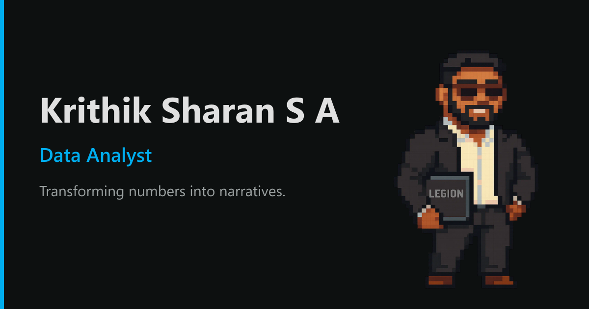

# Krithik Sharan S A — Portfolio

Personal portfolio site for Krithik Sharan S A, a data analyst and MSc Data
Science student at the University of Leeds. Originally prototyped on Lovable,
now a self-hosted single-page app on Netlify with a Supabase backend.

<p align="center">
  
</p>

## Features

- **Sections** — Home, About (with a Skills & Tools grid), Experience, Education,
  Volunteering, Portfolio, Certificates, Contact
- **Project detail pages** — every project (`/portfolio/<slug>`) has its own
  indexable page with objectives, methods, results, contributors and links
- **Portfolio search & filters** — full-text search plus quick tool filters
- **Testimonials rail** — an infinite marquee of recommendations that expand on hover
- **Light / dark mode** — system-aware, remembered per browser, no flash
- **Live visitor counter** — distinct-visitor count via Supabase, shown in the footer
- **Working contact form** — submissions stored in Supabase (`contact_messages`)
- **SEO** — per-route title / description / canonical / OpenGraph tags,
  generated `sitemap.xml`, JSON-LD
- **MCP server** — an optional read-only [Model Context Protocol](https://modelcontextprotocol.io)
  edge function exposing the portfolio as AI-agent tools (`supabase/functions/mcp/`)

## Tech stack

| Area | Choice |
| --- | --- |
| Build / framework | Vite · React 18 · TypeScript |
| Styling | Tailwind CSS · shadcn/ui · framer-motion |
| Routing | react-router-dom (client-side) |
| Backend | Supabase (Postgres + RPC + edge functions) |
| Hosting | Netlify |

## Local development

```bash
npm install
cp .env.example .env    # fill in your Supabase project URL + anon key
npm run dev             # http://localhost:8080
```

### Scripts

| Command | Description |
| --- | --- |
| `npm run dev` | Dev server |
| `npm run build` | Production build to `dist/` (runs the sitemap generator first) |
| `npm run preview` | Serve the production build locally |
| `npm run lint` | ESLint |
| `npm run typecheck` | `tsc --noEmit` |

`node scripts/optimize-images.mjs` re-encodes images in `src/assets` and
`public/lovable-uploads` to WebP — run it after adding new images.

## Environment variables

| Variable | Where |
| --- | --- |
| `VITE_SUPABASE_URL` | `.env` locally · Netlify → Site settings → Environment variables |
| `VITE_SUPABASE_ANON_KEY` | same |

## Project structure

```
src/
  components/      UI components (shadcn/ui in components/ui)
  data/            all portfolio content — edit these files to update the site
  hooks/           useVisitorCount, use-mobile, use-toast
  integrations/    Supabase client + generated types
  lib/             site config, project normaliser, utils
  pages/           one file per route
supabase/
  migrations/      SQL schema (visitors, contact_messages + RPCs)
  functions/mcp/   standalone MCP server (Deno)
scripts/           sitemap + image optimisation
```

## Backend setup

Apply `supabase/migrations/20260831120000_portfolio_backend.sql` in the Supabase
SQL Editor (or `supabase db push`). It creates:

- `visitors` + `track_visit()` / `get_visitor_count()` (SECURITY DEFINER RPCs)
- `contact_messages` with an anonymous-insert-only RLS policy — read submissions
  in the Supabase Table Editor

## Deployment

Netlify builds from `netlify.toml` (`npm run build` → `dist/`, SPA fallback,
cache + security headers). Push to the default branch to deploy.

## License

All rights reserved. Content and personal assets are not licensed for reuse.
